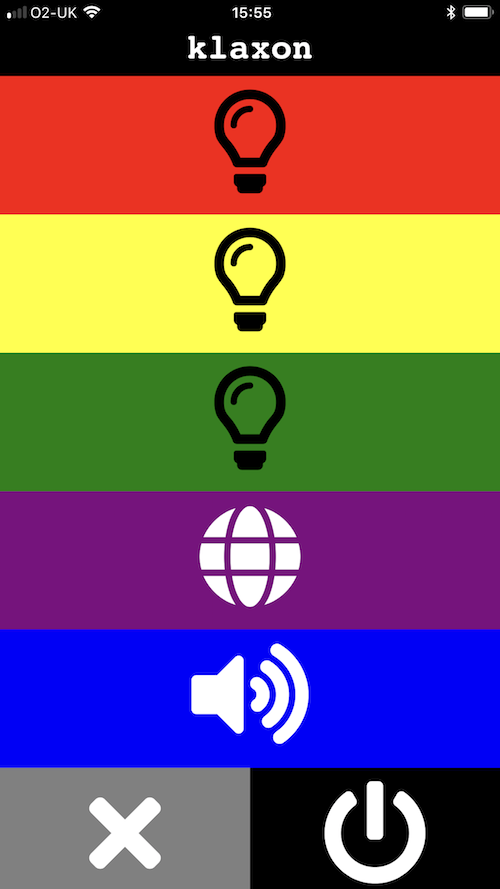

## Teenager Klaxon

Inspired by [http://www.jameswest.site/the-tea-time-klaxon](http://www.jameswest.site/the-tea-time-klaxon)


This is an alternative software package for the Tower Light tutorial in MagPi #73. Full details of how to build the project can be found at [https://raspberrypi.org/magpi](https://raspberrypi.org/magpi) (free PDF download).

In the original tutorial, a very basic web server was implemented. This version has a few more features and an improved interface. It works well on mobile devices and can be installed as a web app on iOS.



### Features

* Responsive web page (works well on smartphones)
* Buzzer support
* Timeout support
* Remote shutdown
* DISCO MODE!

### Additional Wiring

In the original tutorial, we did not wire up the buzzer. This software makes use of it. To add the buzzer:

* Secure a sheilded wire between the Automation pHAT ground and the the relay COM (Common)
* Connect the buzzer wire (orange in my case) to NO (Normally Open) on the relay

The buzzer is _very_ loud, so the software implements a one-second cutoff for the sake of everyone's sanity.

### Installation

Make sure you know the hostname or IP address of the Pi connected to the tower light.

Once the tower light is wired up as per MagPi #73 and the buzzer is connected as above...

```bash
cd
sudo apt update && sudo apt upgrade

# Install the Automation pHAT libraries
curl https://get.pimoroni.com/automationhat | bash

# Install the Flash web app framework globally
sudo -H pip install flask

# Clone this package to the directory '~/pi/klaxon'
git clone https://github.com/mrpjevans/klaxon.git
```

### Test

```bash
python ~/klaxon/klaxon.py
```

If all is well after a second or two the lights on the tower will cycle. You should now be able to go to http://_address-of-tower-light_:5000/

`Ctrl+C` will shut things down.

### Run As a Service

We can set the web server to startup at boot:

```bash
sudo nano /lib/systemd/system/klaxon.service
```

In nano, add the following:

```
[Unit]
Description=Klaxon           
After=multi-user.target

[Service]
Type=idle
ExecStart=/usr/bin/python /home/pi/klaxon/klaxon.py

[Install]
WantedBy=multi-user.target
```
Then `Ctrl+X` followed by `y` to save and exit.

To enabled everything:

```bash
sudo chmod 644 /lib/systemd/system/klaxon.service 
sudo systemctl daemon-reload
sudo systemctl enable klaxon.service
sudo systemctl start klaxon.service
```

The lights should cycle as before. Now the server will start whenever the Pi is booted.

### Usage

Just point a web browser to http://_ip-or-hostname-of-your-pi_:5000/ to see a simple web page that allows you to control the lights, including the ability to shut everything off and also shutdown the system.

It's designed to work well on mobile devices. If you use Safari on iOS, you can 'Add To Home Screen' to create an icon on your phone to go right to the app.

### Thanks
To James West for the original project: [http://www.jameswest.site/the-tea-time-klaxon](http://www.jameswest.site/the-tea-time-klaxon) and to MagPi for featuring it in their magnificent publication (I may be a bit biased).